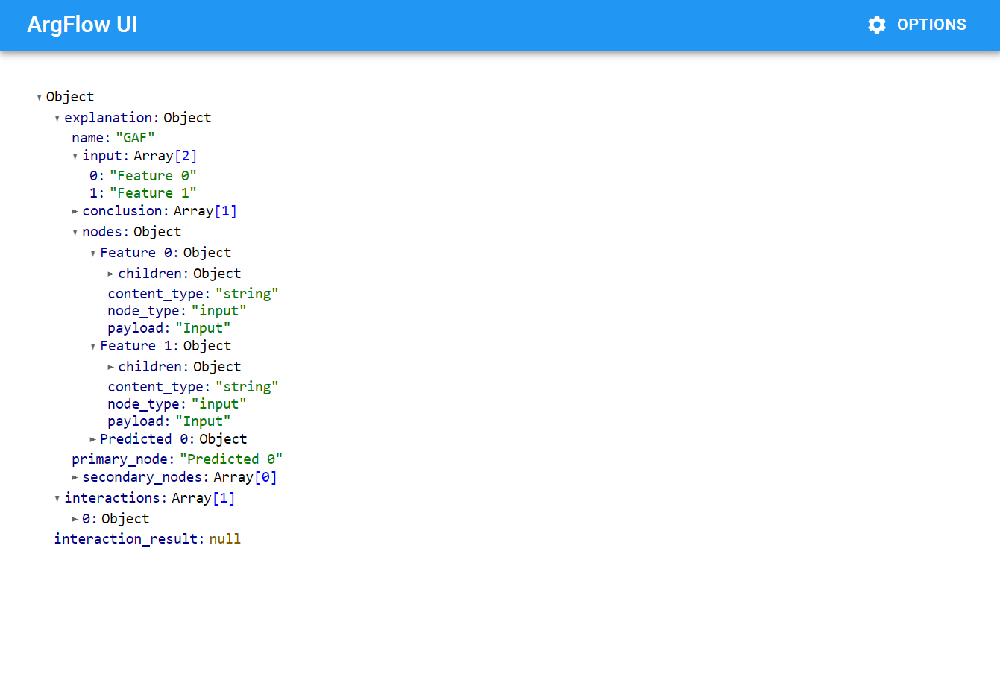

# Visualisers

The portal supports the ability to register additional visualisers at runtime. You could write a visualiser yourself or download one that someone else has shared online.

We provide two built-in visualisers:

- A graph visualiser that renders the explanation as graph.
- A conversation visualiser that allows the user to traverse the explanation in a conversational manner.

The source code for these can be found [here](https://gitlab.doc.ic.ac.uk/xai-crew/portal/-/tree/master/visualisers).

This page describes the design of the visualiser system and will walk you through how to implement your own visualiser.

## Design

A visualiser consists of two components - a (typically small) bit of Python code to glue things together and the bulk of the visualiser implementation in JavaScript.

### Server-side

On the Python side, there a couple of important classes that are relevant to visualisers.

The [`Visualiser`](https://gitlab.doc.ic.ac.uk/xai-crew/portal/-/blob/master/argflow_ui/visualisers/__init__.py#L32) class is the class that represents a visualiser implementation - you must write a class that inherits from this to represent your custom visualiser. This class has a single abstract method `get_module_path`, which should return the path to the main javascript file providing your visualiser implementation. You may additionally override the following methods:

- `get_name` which returns a human readable name
- `get_identifier` which returns a unique identifier for the visualiser
- `create_session` which creates and returns a visualiser session (see below)
- `process_explanation_request` which processes a request for the explanation associated with the given visualiser and returns a VisualiserResponse (see below). By default, this method calls the `process_explanation_request` method of the current visualiser session (if it exists), so you will usually not need to override it.

The second class of relevance here is [`VisualiserSession`](https://gitlab.doc.ic.ac.uk/xai-crew/portal/-/blob/master/argflow_ui/visualisers/__init__.py#L59) - we will come back to this later. Implementing this is optional, but useful for more advanced visualisers that need to perform backend logic or track state. In particular, you may find useful to override the `process_explanation_request` method in order to implement a custom handling logic for the explanation requests.

The visualiser responses to the explanation requests are modelled by the [`VisualiserResponse`](https://gitlab.doc.ic.ac.uk/xai-crew/portal/-/blob/master/argflow_ui/visualisers/__init__.py#L11) class and its subclasses [`VisualiserErrorResponse`](https://gitlab.doc.ic.ac.uk/xai-crew/portal/-/blob/master/argflow_ui/visualisers/__init__.py#L16) and [`VisualiserExplanationResponse`](https://gitlab.doc.ic.ac.uk/xai-crew/portal/-/blob/master/argflow_ui/visualisers/__init__.py#L24). The `process_explanation_request` methods of the visualisers and the visualiser sessions should return instances of these classes.

The last class of relevance is the [`ArgumentationGraphView`](https://gitlab.doc.ic.ac.uk/xai-crew/portal/-/blob/master/argflow_ui/visualisers/argumentation_views.py#L4) which models the view of the visualiser on the underlying argumentation graph. The `create_session` method of the visualiser is responsible for creating this view using the argumentation graph supplied as a parameter.

### Client-side

To be able to actually display something within the portal, you must write some JavaScript code that can be integrated with the portal frontend.

The portal loads visualisers dynamically at runtime by taking advantage of the [dynamic module imports](https://developer.mozilla.org/en-US/docs/Web/JavaScript/Reference/Statements/import) feature available in modern web browsers. A visualiser must be a valid ES module with a [default export](https://developer.mozilla.org/en-US/docs/Web/JavaScript/Reference/Statements/export#Using_the_default_export) that is a class of the form:

```javascript
export default class MyVisualiser {
  constructor(modelName, explanationName, container, ws) { ... }

  // Optional, can be used to perform any cleanup operations
  destroy() { ... }
}
```

The user is able to select the visualiser that they want to use from a menu on the page. When your visualiser is selected, the application will import the module and instantiate this class, passing it several arguments:

- `modelName` - The name of the current model
- `explanationName` - The name of the current explanation
- `container` - A reference to an HTML `div` element which the visualiser should render its contents to.
- `ws` - A websocket connection handle - see below.

The `modelName` and `explanationName` can be used to retrieve the actual graph data from the server, using the API.

If the user navigates away, or selects a different visualiser, the application will invoke the `destroy` method on your visualiser class (if the method exists), allowing it to perform any cleanup as necessary.

### Sessions

The visualiser system has the concept of a visualiser session, which represents the lifecycle of a visualiser and is tied to the lifecycle of a websocket connection. When a visualiser is instantiated, a websocket connection to the server is opened and a new session is created on the server. The socket will be disconnected if the user selects a different visualiser, or if they navigate away or close the browser tab. When this socket disconnects, the session is also destroyed on the server. This system provides a means for visualisers to communicate with the server (in case custom server-side functionality is required) and to store session state on the server.

## Walkthrough - A pretty json visualiser

This section will walk you through building a basic visualiser that pretty prints the explanation graph json to the screen. This will provide an overview of the components necessary to implement more advanced (and useful!) visualisers.

We will use [this](https://github.com/mohsen1/json-formatter-js) library to implement the json viewer. To start off, run the following commands to clone and build the library:

```
> git clone https://github.com/mohsen1/json-formatter-js
> cd json-formatter-js
> npm install
> npm run build
```

We will start off by writing some python code to tell the portal about the new visualiser that we are creating.

```python
from argflow_ui import ArgflowUI
from argflow_ui.visualisers import Visualiser


class JsonVisualiser(Visualiser):
    def get_module_path(self):
        return "./JsonVisualiser.js"


app = ArgflowUI(resource_path="examples")

app.register_js_module("json-formatter-js", "./json-formatter-js/dist/json-formatter.esm.js")
app.register_visualiser(JsonVisualiser())

app.run()
```

There are two ways to run the portal application - firstly, we provide a helpful shell command `argflow-ui` to start the portal with default configurations. However, the portal is designed to be highly extensible, and to be able to extend it we must write a custom startup script to register our extensions. This is what we are doing here.

We create an instance of `ArgflowUI` which represents the portal application object, passing it `resource_path` which is the path to the directory where models and explanations should be read from and written to.

The interesting part comes next, where we register our extensions with the application. Here, we are telling it to include an additional javascript module pointing to the location of the library we downloaded earlier. This will be made available at `/modules/json-formatter-js`. We also register out custom visualiser which is an instance of a class inheriting from `Visualiser`. This class defines a single method `get_module_path` which returns the path to our actual visualiser implementation which we will create in a moment.

Finally, we call `app.run()` which starts the application and launches the browser by default.

Moving on to the actual implementation, we create a javascript file called `JsonVisualiser.js` looking like this:

```javascript
import JSONFormatter from "/modules/json-formatter-js";

export default class JsonVisualiser {
  // Note that we omit the `ws` parameter since we will not be using it
  constructor(modelName, explanationName, container) {
    fetch(`/api/models/${modelName}/explanations/${explanationName}`)
      .then((res) => res.json())
      .then((json) => {
        const root = document.createElement("div");
        root.style.padding = "32px";
        root.appendChild(new JSONFormatter(json).render());
        container.appendChild(root);
      });
  }
}
```

The first line simply imports the library that we registered earlier. The module has a default export that is the visualiser class. In the constructor, we fetch the explanation graph from the portal backend using the API, then use the library to render a formatted version of the json data into the container div. Notice that we create a separate div element which we apply styles to and then append that to the top level container. This is because the container is not recreated for different visualisers, so any styles we apply to it would persists even if the user switched visualiser. We could avoid this by removing the styles in our `destroy()` method, but this is simpler.

At this point, we are done. If you run the python script to start the app and open an explanation, you should see something looking like this:



This introduces the process of creating a custom visualiser. For examples of more complex usage, see the source code for the built in visualisers. These are built with React and use [Rollup](https://rollupjs.org/) to bundle the dependencies.
